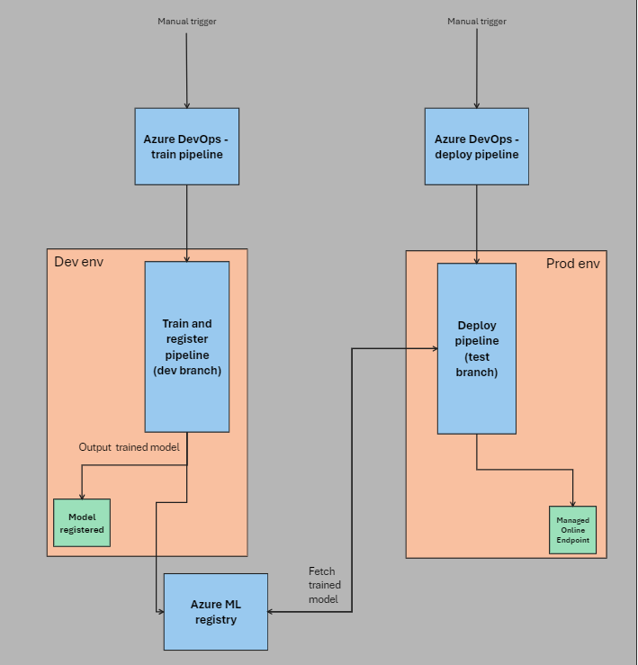

# Multiple environment MLOps on Azure using Azure DevOps, Azure Machine Learning and Azure Machine Learning Registries

This work-in-progress fork for the MLOps v2 accelerator looks at incorporating Azure Machine Learning registeries to support multi-environment sharing of models, environments and other assets. The current state of the repository is not too disimiliar from the original repository, but the flow can be seen below:

Essentially, this addition now includes registering and sharing a model to a shared Azure ML registry which is then referenced and deployed in a second workspace in-line with the 'model promotion' pattern. There are a few pre-alpha features included i.e. automatically triggering the deployment pipeline based on the completion of the training pipeline and also registering the model into the second workspace as opposed to directly deploying from the registry.

## Getting started

In a similar vain to the MLOps V2 accelerator, documented [here](https://learn.microsoft.com/en-us/azure/machine-learning/how-to-setup-mlops-azureml?view=azureml-api-2&tabs=azure-shell), you can clone this repository into your ADO project and work through the files to correspond to your environment set-up.

List of requirements:
* 2 Azure Machine Learning workspaces,
* An Azure Machine Learning registry,
* A compute instance per attendee,
* A shared compute cluster,
* A service principle / managed identity with `Contributor` access at the subscription level,
* An Azure DevOps project,
* A managed identity with the `Azure ML Registry User` role over the Azure Machine Learning registry as well as the `Contributor` role over both Azure Machine Learning workspaces.

## Supporting links

* [Pipeline triggers](https://learn.microsoft.com/en-us/azure/devops/pipelines/process/pipeline-triggers?view=azure-devops#configure-pipeline-resource-triggers)
* [What are Azure ML registries?](https://learn.microsoft.com/en-us/azure/machine-learning/concept-machine-learning-registries-mlops?view=azureml-api-2)
* [How to share a model to a registry](https://learn.microsoft.com/en-us/azure/machine-learning/how-to-share-models-pipelines-across-workspaces-with-registries?view=azureml-api-2&tabs=python#create-a-model-in-registry)
* [MLOps on Azure](https://learn.microsoft.com/en-us/azure/machine-learning/concept-model-management-and-deployment?view=azureml-api-2)

## Roadmap
* Improve documentation,
* Leverage ADO variable groups,
* Verify the most appropriate RBAC roles needed.
